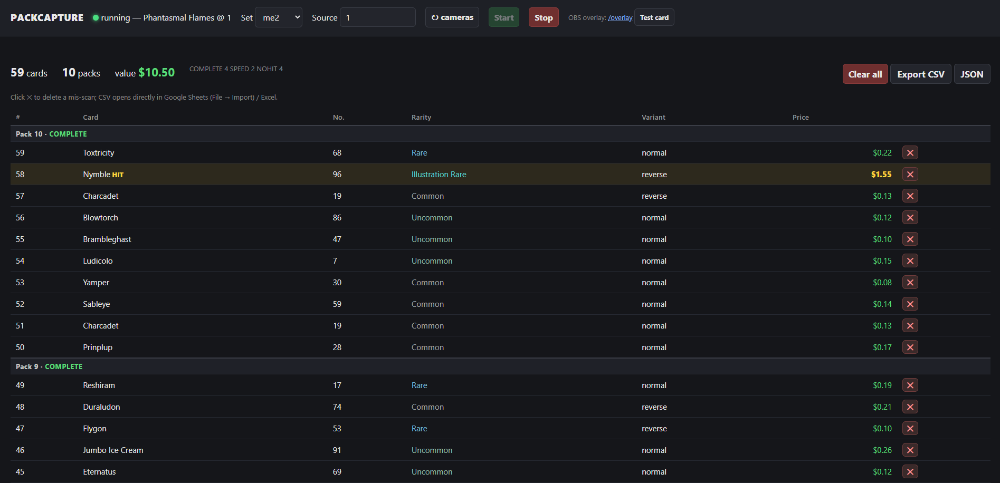
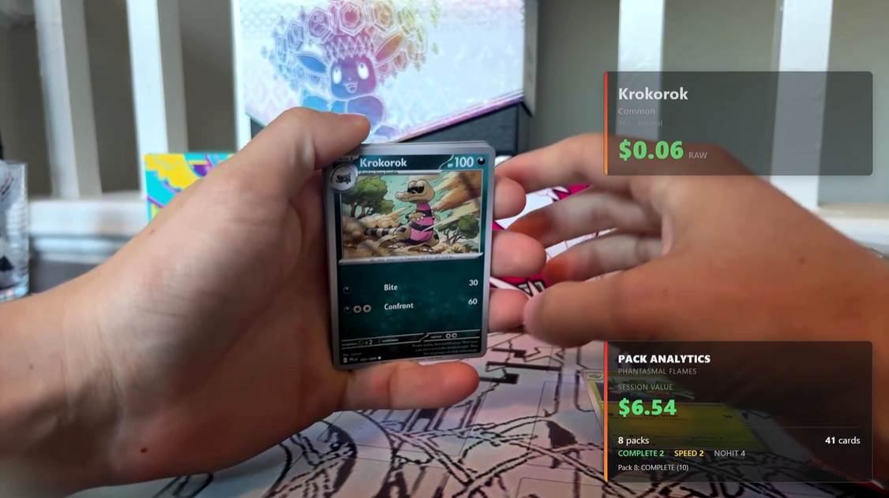

<p align="center">
  
</p>

<p align="center">
  <b>Computer-vision card logger for Pokémon TCG pack openings.</b><br>
  Point a camera at your pulls — PackCapture detects, recognizes, and logs every
  card automatically, with a live price overlay for streams and clean data export
  instead of manual spreadsheet entry.
</p>

<p align="center">
  <a href="https://github.com/masonmmorano/packcapture/actions/workflows/tests.yml"></a>
  <a href="LICENSE"></a>
  
  
  <a href="https://pokemontcg.io"></a>
  
</p>

> **Status:** active development. The live pipeline works end to end — recognize
> cards from a camera, a price overlay for OBS, an operator control panel, and
> CSV/JSON export. A persistent session database and pull-rate analytics are next.

## See it in action

<p align="center">
  <a href="https://www.youtube.com/watch?v=h8b6s0PN_vs">
    
  </a><br>
  <sub>▶ <b><a href="https://www.youtube.com/watch?v=h8b6s0PN_vs">Watch a one-pack rip</a></b> — cards recognized, priced, and logged live with the in-stream overlay.</sub>
</p>

## Highlights

&nbsp; **Offline & set-locked** — recognition searches one set's ~100–400 cards, no network at match time.<br>
&nbsp; **Live, in real time** — a threaded recognizer runs on any webcam, OBS Virtual Cam, or a phone-as-webcam while the video stays smooth.<br>
&nbsp; **In-stream overlay for OBS** — a transparent price ticker + pack-analytics panel viewers see as you scan each card.<br>
&nbsp; **Operator control panel** — a browser cockpit to pick a set + camera, start/stop, watch the live card log, fix mis-scans, and export to CSV/JSON.<br>
&nbsp; **Pack-aware** — packs are segmented and labelled (`COMPLETE` / `SPEED_RIPPED` / `NO_HIT`); a per-pack checksum flags any full pack that doesn't reconcile.

## Install (Windows, Python 3.10+)

```powershell
py -3.10 -m venv .venv
.\.venv\Scripts\Activate.ps1
pip install -e .
```

The **Phantasmal Flames** (`me2`) set ships in the repo with prices baked in, so
recognition works out of the box — no API key, no build step.

## Start it

```powershell
packcapture gui
```

Then open the printed link (**http://localhost:8770/control**) in your browser.

## Work it

In the control panel:

1. **Pick the set** (`me2`) and your **camera** (click **↻ cameras**, or type a
   device index / a video file path). No camera yet? Point it at a recorded clip.
2. Press **Start** and **scan cards** — each one is recognized, priced, and added
   to the live log. Hold each card to the camera for a beat in decent light.
3. Made a bad scan? Click **✕** on that row to delete it (or **Clear all**).
4. Press **Export CSV** when you're done — it opens straight in Google Sheets.

<p align="center">
  <br>
  <sub>The control panel mid-session: a live card log grouped by pack, hits highlighted, with running totals and CSV/JSON export.</sub>
</p>

### Show prices on stream (OBS)

PackCapture also serves a transparent overlay at **http://localhost:8770/overlay**.
Add it in OBS as a **Browser Source** and it floats the price ticker + pack
analytics over your camera for viewers.

<p align="center">
  <br>
  <sub>Live in OBS: a card recognized as it's scanned — the price ticker pops the card + raw price, with the running pack-analytics panel.</sub>
</p>

→ Full walkthrough (camera sharing, OBS Virtual Camera, tips):
**[Live & OBS Setup](../../wiki/Live-and-OBS-Setup)**

## More

- **[CLI Reference](../../wiki/CLI-Reference)** — every command: building other
  sets, refreshing prices, the recorded-clip renderer, dev mode, how recognition
  works, bundle layout.
- **[Live & OBS Setup](../../wiki/Live-and-OBS-Setup)** — the full streaming setup.
- **[Wiki home](../../wiki)** · **[CLAUDE.md](CLAUDE.md)** — design notes and plan.

## License

MIT
